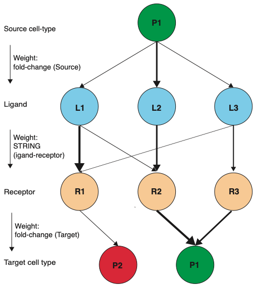
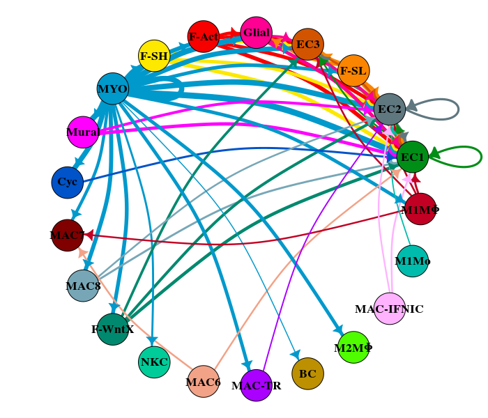
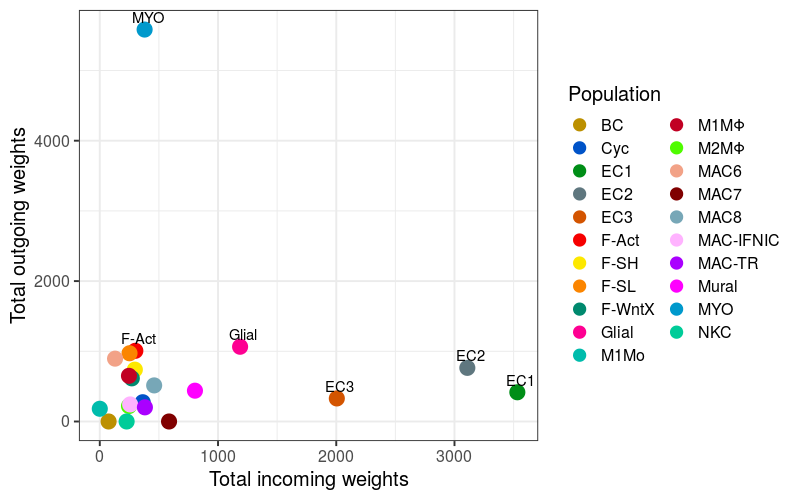
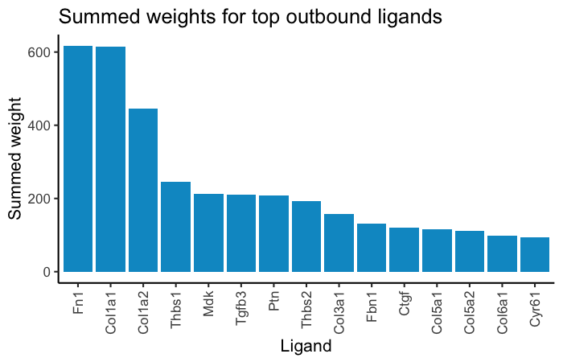
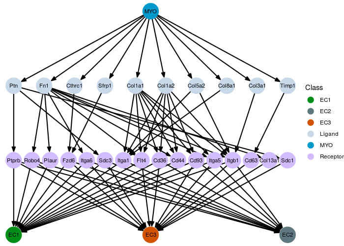

```{r setup,echo=FALSE}
library(knitr)
library(BiocStyle)

#Color Format
colFmt = function(x,color){
  outputFormat = knitr::opts_knit$get("rmarkdown.pandoc.to")
  if(outputFormat == 'latex')
    paste("\\textcolor{",color,"}{",x,"}",sep="")
  else if(outputFormat == 'html')
    paste("<font color='",color,"'>",x,"</font>",sep="")
  else
    x
}

```


# Introduction

scTalk is an R package implementation of the scRNA-seq cell-cell communication method described in [Farbehi et al.](https://elifesciences.org/articles/43882) Briefly, the approach is to build weighted graphs linking 'source' cell types (those expressing a ligand) to 'target' cell types (those expressing a corresponding receptor). A four-layer acyclic graph is built such that the top layer of nodes represents the source cell types, second layer the ligands expressed by these cells, third layer the receptors targetted by the ligands and fourth layer the cell types expressing the receptors. Weights for the source:ligand and receptor:target edges are derived from fold-change expression of the genes in the relevant populations compared to all other cells in the experiment. Weights for ligand:receptor edges are derived using protein:protein association scores from the STRING database. Ligand:receptor connections are derived from [Ramilowski et al.](https://www.ncbi.nlm.nih.gov/pubmed/26198319).

```{r cartoon, out.width='75%', fig.cap = 'Method schematic',echo=FALSE}

```

Once the edge weights have been calculated, an overall weight between any two cell populations is calculated by summing up the weights along all the paths connecting them. In order to determine what cell-cell connections are most signifcant, the source:ligand and receptor:target edges are randomly permutated, randomised cell-cell weights are recalculated and compared to the real weights to derive an empirical P-value. Finally, scTalk has several visualisation options available for plotting the cell-cell connections, the tendency for cell populations to exhibit more 'outbound' (ligand expressing) or 'inbound' (receptor expressing) gene expression patterns, top ligands for a cell population and specific source:ligand:receptor:target network diagrams. 


# scTalk Installation

scTalk can be installed from github


```
install.packages("devtools")
devtools::install_github("VCCRI/scTalk", build = TRUE, build_vignettes = TRUE, build_opts = c("--no-resave-data", "--no-manual"))

```


# Preparing input data sets

For this vignette, we will be using cardiac scRNA-seq from [Farbehi et al.](https://elifesciences.org/articles/43882). This study profiled cardiac interstitial cells from the hearts of mice subject to a myocardial infarction (MI) injury or sham control surgery. For the purpose of this vignette we have provided a small subset of the data from the MI-day 7 time-point.    

## Input

### Seurat object 
scTalk operates on a Seurat object with pre-defined cell identities/clusters. 


### Vignette example file
For this vignette we have produced a reduced file to follow along with the following example. The following R code define the location of the vignette example files. 

```
extdata_path <- system.file("extdata",package = "scTalk")
tip.seurat.file <- paste0(extdata_path,"/TIP_MI-day7_small.RData")

```

# Pipeline

edge weights >> network paths >> permutation testing >> visualisation 

## Generate edge weights

```
library(Seurat)
library(scTalk)

## Load the example Seurat object
load(tip.seurat.file)

## Define clusters to use in the analysis
populations.use <- names(table(Idents(tip.mid7)))

## Define a label for output files
file.lab <- "TIP"


```

Now we'll use the ``GenerateEdgeWeights`` function to calculate weighted connections between clusters:ligands, ligands:receptors and receptors:clusters. 
```
GenerateEdgeWeights(seurat.object = tip.mid7,
                    file.label = file.lab,
                    species = "mouse",
                    populations.use = populations.use)
```

This function will produce a file containing all network edges: the source node, target node, the relationship (cluster:ligand, receptor:cluster, ligand:receptor) and the
corresponding weight. We can look at the info in the file:

```
edge.table <- read.csv(paste0(file.lab, "_all_ligand_receptor_network_edges.csv"))
edge.table <- edge.table[order(edge.table$weight, decreasing = TRUE), ]
head(edge.table)
```


|     |Source | target | relationship    | Weight   |
|-----|-------|--------|-----------------|----------|
|4488 |S:MAC6 | S100a8 | cluster.ligand  | 8.945521 |
|4506 |S:MAC6 | S100a8 | cluster.ligand  | 8.495630 |
|2987 |S:MAC6 | Camp   | cluster.ligand  | 6.978928 |
|3042 |S:NKC  | Ccl5   | cluster.ligand  | 5.466655 |
|4622 |S:MAC6 | Slpi   | cluster.ligand  | 5.219718 |
|1114 |Cd79a  | T:BC   | receptor.cluster| 4.482905 |


## Generate network paths

Next, we will use the ``GenerateNetworkPaths`` function to build the cell:cell paths, via the connections we created in the previous step. The following step will use permutation testing to ascertain significant cell:cell connections, which requires a background. ``GenerateNetworkPaths`` will create a file of cell:cell connections above a provided minimum weight threshold, 1.5 by default. It will also create a background file of all potential connections, with no thresholding. Number of cores can be specified to speed up the analysis.

```
GenerateNetworkPaths(file.label = file.lab,
                     min.weight = 1.5,
                     ncores = 4)
```

As above let's open the file and have a look. 

```
paths.table <- read.csv(paste0(file.lab, "_network_paths_weight1.5.csv"), row.names=1, stringsAsFactors = FALSE)
paths.table <- paths.table[order(paths.table$Weight, decreasing = TRUE), ]
head(paths.table)

```
|      |Source |Ligand  |Receptor |Target   |Weight   |
|------|-------|--------|---------|---------|---------|      
|91315 |S:MAC6 |S100a8  |Tlr4     |T:MAC-TR |9.974285 |
|10347 |S:MAC6 |S100a8  |Tlr4     |T:MAC8   |9.858965 |
|97215 |S:MAC6 |S100a8  |Tlr4     |T:M2MΦ   |9.677949 |
|9666  |S:MAC6 |S100a8  |Tlr4     |T:M1MΦ   |9.672766 |
|81316 |S:MAC6 |S100a8  |Tlr4     |T:F-SH   |9.657012 |
|86119 |S:MAC6 |S100a8  |Tlr4     |T:M1Mo   |9.647094 |


## Identify significant cell-cell connections

The final analysis step is to perform a permutation test on the number of cell-cell connections that pass the minimum weight threshold (e.g. 1.5) from the previous step. Permutation testing is used to select cluster:ligand and receptor:cluster edges at random from the background file and compare the randomised cell:cell connections to the real one. By default, 100,000 permutations are used, though this can be modified with the ``num.permutations`` paramater. 

```
results.table <- EvaluateConnections(file.label = file.lab, 
                                     ncores = 4,
                                     return.results = TRUE)
head(results.table)
```

|   |Source_population |Target_population |Num_paths |Sum_path |Sum_path_pvalue |Sum_path_padj |
|-----|---------|-------|-----|---------------|-------|---|
|2    |M1MΦ     |EC1    |51   |147.7263       |0      |0  |
|11   |M1MΦ     |EC2    |49   |132.8273       |0      |0  |
|26   |EC1      |EC1    |59   |157.2924       |0      |0  |
|35   |EC1      |EC2    |54   |134.6211       |0      |0  |
|50   |F-SL     |EC1    |107  |276.4395       |0      |0  |
|57   |F-SL     |EC3    |94   |218.0655       |0      |0  |

This is the table that is used for visualising significant cell-cell connections. This can be done using the ``CellCirclePlot`` function described below. Alternatively, the table can be read into Cytoscape, which has powerful network visualisation capabilities. 

## Visualising networks

scTalk has four main visualisation options available to it. 

### Circle plot

In order to visualise the significant cell-cell connections we will use a circle plot. ``CellCirclePlot`` will use a default colour gradient, but you can select your own colour scheme as well. To do this create a named vector of colour codes:

```
col.set <- c("#c10023", "#008e17", "#fb8500", "#f60000", "#fde800", "#bc9000","#4ffc00", "#00bcac", "#0099cc", "#D35400", "#00eefd", "#5f777f", "#cf6bd6", "#99cc00", "#aa00ff", "#ff00ff", "#0053c8","#f2a287","#ffb3ff", "#800000", "#77a7b7", "#00896e", "#00cc99", "#FE0092")

p.labels <- c("M1M\u03A6", "EC1", "F-SL", "F-Act", "F-SH", "BC", "M2M\u03A6", "M1Mo", "MYO","EC3", "DC", "EC2", "TC1-Cd8", "TC2-Cd4", "MAC-TR", "Mural", "Cyc", "MAC6", "MAC-IFNIC", "MAC7", "MAC8", "F-WntX", "NKC", "Glial")

names(col.set) <- p.labels
```

``CellCirclePlot`` will generate a figure connecting cells based on an adjusted P-value threhsold. We use a threshold of 0.01 below to focus on visualising the strongest connections.

```
## Generate a circle plot
cell.network.file = paste0("Permutation_tests_", file.lab, "_network.csv")
CellCirclePlot(input.file = cell.network.file, 
               adj_pval_thresh = 0.01, 
               col.set = col.set)
```

For this example can see that MYO has a large number of outbound connections

```{r circleplot, out.width='100%', fig.cap = 'Circle Plot output',echo=FALSE}

```

### Inbound/outbound weights plot

The concept behind this plot is that some cell populations may tend to exhibit more 'outbound', or ligand expressing activity, while other exhibit more 'inbound', or receptor expressing, activity. ``InboundOutboundPlot`` takes the cell-cell connections that are determined to be significant, and sums the weights each of the 'source' (outbound) and 'target' (inbound) populations and plots these values against each other. More outbound populations will tend to be higher up the Y-axis, with inbound populations higher along the Y-axis. 

```
## Generate an inbound vs outbound plot
InboundOutboundPlot(input.file = cell.network.file, 
                    col.set = col.set,
                    p.adj.thresh = 0.05)
```

```{r inboundoutbound, out.width='100%', fig.cap = 'Inbound vs outbound plot',echo=FALSE}

```

### Plot top ligands

To plot the top ligands in a population use the ``PlotTopLigands`` function. Colour of the bar plot can be made to match cell identity colour scheme with the ``col.use`` parameter.

```
## Plot top ligands for a cell population
path.file <- paste0(file.lab, "_network_paths_weight1.5.csv")
cell.type <- "MYO"
PlotTopLigands(input.file = path.file, 
               col.use = "#0099cc",
               cell.identity = cell.type)
```

```{r topligands, out.width='100%', fig.cap = 'Top ligands plot',echo=FALSE}

```

### Tree plot

The purpose of the tree plot, shown below, is to visualise the ligand:receptor paths between a source and a set of target cell types. The plot can easily get very 'busy' if there are too many nodes. There are a few ways to handle this. One is to reduce the number of target nodes. For this example, we will simply connect MYO (myofibroblasts) to EC (endothelial cell) populations. Another way is to only plot the top ligands. Here we will use the Seurat FindMarkers program to select upregulated genes, which will be input to ``NetworkTreePlot``.

```
## First, select ligands upregulated in source population
source.marker.table <- Seurat::FindMarkers(tip.mid7, ident.1 = "MYO", 
                                           logfc.threshold = 1.5, 
                                           only.pos = TRUE)
source.marker.genes <- rownames(source.marker.table)
```

Generate a tree plot linking MYO to the EC populations:

```
path.file <- paste0(file.lab, "_network_paths_weight1.5.csv")
edge.score.file <- paste0(file.lab, "_all_ligand_receptor_network_edges.csv")
source.population <- "MYO"
target.populations <- c("EC1", "EC2", "EC3")
population.cols <- c("#0099cc", "#008e17", "#5f777f", "#D35400")

NetworkTreePlot(path.file = path.file, 
                edge.score.file = edge.score.file,
                source.population = source.population,
                target.populations = target.populations,
                source.marker.genes = source.marker.genes,
                population.cols = population.cols)
```

```{r treeplot, out.width='100%', fig.cap = 'Tree plot',echo=FALSE}

```


# Session Information-----------------------------------

```{r sessionInfo}
sessionInfo()
```


